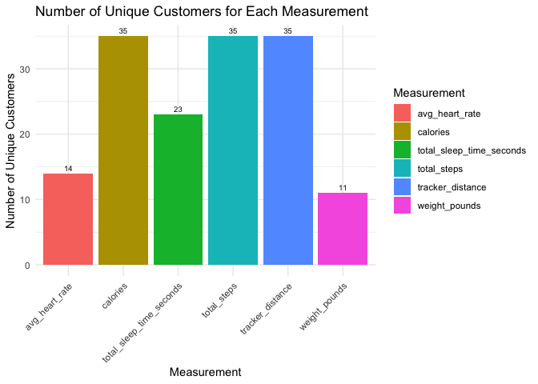
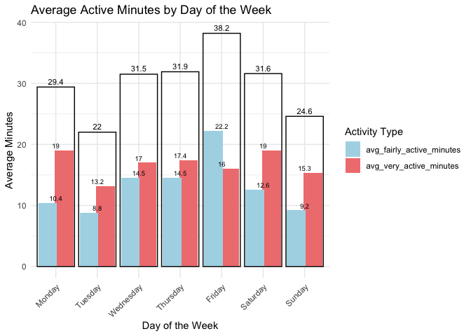
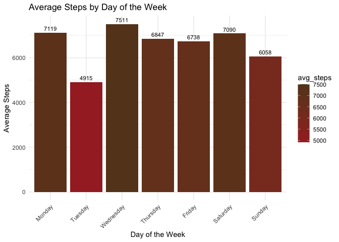
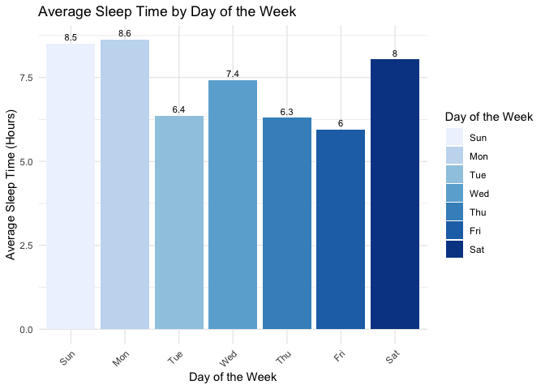
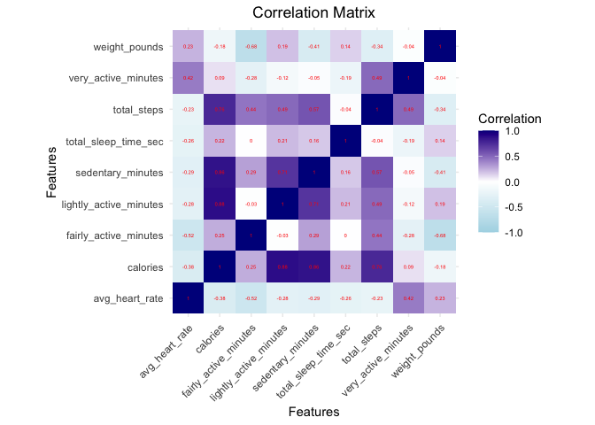

Trends in non Bellabeat SMART device
================
AllaB
2024-07-18

## Introduction

Bellabeat, a high-tech manufacturer of health-focused products for
women. Bellabeat is a successful small company, but they have the
potential to become a larger player in the global smart device market.
The co-founder and Chief Creative officer of Bellabeat, believes that
analyzing smart device fitness data could help unlock new growth
opporunities for the company. FitBit Fitness Tracker Data (CC0: Public
Domain, dataset made available through Mobius): This
[Kaggle](https://www.kaggle.com/datasets/arashnic/fitbit) data set
contains personal fitness tracker from thirty fitbit users. Thirty
eligible Fitbit users consented to the submission of personal tracker
data, including minute-level output for physicalactivity, heart rate,
and sleep monitoring. It includes information about daily activity,
steps, and heart rate that can be used to explore users’ habits.

## Goal of the Project

The goal of the project - is to analyze smart device usage data in order
to gain insight into how consumers use non-Bellabeat devices. There are
3 main questions need to be answered:

- What are some trends in smart device usage?
- How could these trends apply to Bellabeat customers?
- How could these trends help influence Bellabeat marketing strategy?

## Setting up my environment

``` r
# Setting up my R environment by loading several packages
library(tidyverse)
```

    ## ── Attaching core tidyverse packages ──────────────────────── tidyverse 2.0.0 ──
    ## ✔ dplyr     1.1.4     ✔ readr     2.1.5
    ## ✔ forcats   1.0.0     ✔ stringr   1.5.1
    ## ✔ ggplot2   3.5.1     ✔ tibble    3.2.1
    ## ✔ lubridate 1.9.3     ✔ tidyr     1.3.1
    ## ✔ purrr     1.0.2     
    ## ── Conflicts ────────────────────────────────────────── tidyverse_conflicts() ──
    ## ✖ dplyr::filter() masks stats::filter()
    ## ✖ dplyr::lag()    masks stats::lag()
    ## ℹ Use the conflicted package (<http://conflicted.r-lib.org/>) to force all conflicts to become errors

``` r
library(knitr)
library(dplyr)
library(ggplot2)
library(tidyr)
library(readr)
library(purrr)
library(stringr)
library(forcats)
library(here)
```

    ## here() starts at /Users/allabannikova/Documents/Alla/Alla/Google_DA_Cert_Programm/Portfilio project/Fitbit project/Trends-in-non-Bellabeat-SMART-device

``` r
library(skimr)
library(janitor)
```

    ## 
    ## Attaching package: 'janitor'
    ## 
    ## The following objects are masked from 'package:stats':
    ## 
    ##     chisq.test, fisher.test

``` r
library(lubridate)
library(hms)
```

    ## 
    ## Attaching package: 'hms'
    ## 
    ## The following object is masked from 'package:lubridate':
    ## 
    ##     hms

## Load the CSV files

``` r
# Construct the file paths using 'file.path'
daily_activity_path <- file.path(my_path, "dailyActivity_merged.csv")
sleep_day_path <- file.path(my_path, "minuteSleep_merged.csv")
heart_rate_path <- file.path(my_path, "heartrate_seconds_merged.csv")
weight_logs_path <- file.path(my_path, "weightLogInfo_merged.csv")

#print(daily_activity_path)
# Convert the relative path to an absolute path
#full_daily_activity_path <- normalizePath(daily_activity_path, mustWork = FALSE)

#if (!file.exists(full_daily_activity_path)) {
#  stop(paste("The daily activity file does not exist at the specified path:", #full_daily_activity_path))
#}


# Read the files
daily_activity <- read.csv(daily_activity_path)
sleep_day <- read.csv(sleep_day_path)
heart_rate <- read.csv(heart_rate_path)
weight_logs <- read.csv(weight_logs_path)
```

``` r
# Remove duplicate rows from the 'daily_activity' data frame
daily_activity <- unique(daily_activity, drop = FALSE)
```

## Exploring the data

``` r
View(daily_activity)
View(sleep_day)
View(heart_rate)
View(weight_logs)
```

``` r
head(daily_activity)
```

    ##           Id ActivityDate TotalSteps TotalDistance TrackerDistance
    ## 1 1503960366    3/25/2016      11004          7.11            7.11
    ## 2 1503960366    3/26/2016      17609         11.55           11.55
    ## 3 1503960366    3/27/2016      12736          8.53            8.53
    ## 4 1503960366    3/28/2016      13231          8.93            8.93
    ## 5 1503960366    3/29/2016      12041          7.85            7.85
    ## 6 1503960366    3/30/2016      10970          7.16            7.16
    ##   LoggedActivitiesDistance VeryActiveDistance ModeratelyActiveDistance
    ## 1                        0               2.57                     0.46
    ## 2                        0               6.92                     0.73
    ## 3                        0               4.66                     0.16
    ## 4                        0               3.19                     0.79
    ## 5                        0               2.16                     1.09
    ## 6                        0               2.36                     0.51
    ##   LightActiveDistance SedentaryActiveDistance VeryActiveMinutes
    ## 1                4.07                       0                33
    ## 2                3.91                       0                89
    ## 3                3.71                       0                56
    ## 4                4.95                       0                39
    ## 5                4.61                       0                28
    ## 6                4.29                       0                30
    ##   FairlyActiveMinutes LightlyActiveMinutes SedentaryMinutes Calories
    ## 1                  12                  205              804     1819
    ## 2                  17                  274              588     2154
    ## 3                   5                  268              605     1944
    ## 4                  20                  224             1080     1932
    ## 5                  28                  243              763     1886
    ## 6                  13                  223             1174     1820

``` r
head(sleep_day)
```

    ##           Id                 date value       logId
    ## 1 1503960366 3/13/2016 2:39:30 AM     1 11114919637
    ## 2 1503960366 3/13/2016 2:40:30 AM     1 11114919637
    ## 3 1503960366 3/13/2016 2:41:30 AM     1 11114919637
    ## 4 1503960366 3/13/2016 2:42:30 AM     1 11114919637
    ## 5 1503960366 3/13/2016 2:43:30 AM     1 11114919637
    ## 6 1503960366 3/13/2016 2:44:30 AM     1 11114919637

``` r
head(heart_rate)
```

    ##           Id                Time Value
    ## 1 2022484408 4/1/2016 7:54:00 AM    93
    ## 2 2022484408 4/1/2016 7:54:05 AM    91
    ## 3 2022484408 4/1/2016 7:54:10 AM    96
    ## 4 2022484408 4/1/2016 7:54:15 AM    98
    ## 5 2022484408 4/1/2016 7:54:20 AM   100
    ## 6 2022484408 4/1/2016 7:54:25 AM   101

``` r
head(weight_logs)
```

    ##           Id                 Date WeightKg WeightPounds Fat   BMI
    ## 1 1503960366 4/5/2016 11:59:59 PM     53.3     117.5064  22 22.97
    ## 2 1927972279 4/10/2016 6:33:26 PM    129.6     285.7191  NA 46.17
    ## 3 2347167796 4/3/2016 11:59:59 PM     63.4     139.7731  10 24.77
    ## 4 2873212765 4/6/2016 11:59:59 PM     56.7     125.0021  NA 21.45
    ## 5 2873212765 4/7/2016 11:59:59 PM     57.2     126.1044  NA 21.65
    ## 6 2891001357 4/5/2016 11:59:59 PM     88.4     194.8886  NA 25.03
    ##   IsManualReport        LogId
    ## 1           True 1.459901e+12
    ## 2          False 1.460313e+12
    ## 3           True 1.459728e+12
    ## 4           True 1.459987e+12
    ## 5           True 1.460074e+12
    ## 6           True 1.459901e+12

``` r
str(daily_activity)
```

    ## 'data.frame':    457 obs. of  15 variables:
    ##  $ Id                      : num  1.5e+09 1.5e+09 1.5e+09 1.5e+09 1.5e+09 ...
    ##  $ ActivityDate            : chr  "3/25/2016" "3/26/2016" "3/27/2016" "3/28/2016" ...
    ##  $ TotalSteps              : int  11004 17609 12736 13231 12041 10970 12256 12262 11248 10016 ...
    ##  $ TotalDistance           : num  7.11 11.55 8.53 8.93 7.85 ...
    ##  $ TrackerDistance         : num  7.11 11.55 8.53 8.93 7.85 ...
    ##  $ LoggedActivitiesDistance: num  0 0 0 0 0 0 0 0 0 0 ...
    ##  $ VeryActiveDistance      : num  2.57 6.92 4.66 3.19 2.16 ...
    ##  $ ModeratelyActiveDistance: num  0.46 0.73 0.16 0.79 1.09 ...
    ##  $ LightActiveDistance     : num  4.07 3.91 3.71 4.95 4.61 ...
    ##  $ SedentaryActiveDistance : num  0 0 0 0 0 0 0 0 0 0 ...
    ##  $ VeryActiveMinutes       : int  33 89 56 39 28 30 33 47 40 15 ...
    ##  $ FairlyActiveMinutes     : int  12 17 5 20 28 13 12 21 11 30 ...
    ##  $ LightlyActiveMinutes    : int  205 274 268 224 243 223 239 200 244 314 ...
    ##  $ SedentaryMinutes        : int  804 588 605 1080 763 1174 820 866 636 655 ...
    ##  $ Calories                : int  1819 2154 1944 1932 1886 1820 1889 1868 1843 1850 ...

``` r
str(sleep_day)
```

    ## 'data.frame':    198559 obs. of  4 variables:
    ##  $ Id   : num  1.5e+09 1.5e+09 1.5e+09 1.5e+09 1.5e+09 ...
    ##  $ date : chr  "3/13/2016 2:39:30 AM" "3/13/2016 2:40:30 AM" "3/13/2016 2:41:30 AM" "3/13/2016 2:42:30 AM" ...
    ##  $ value: int  1 1 1 1 1 1 2 2 1 1 ...
    ##  $ logId: num  1.11e+10 1.11e+10 1.11e+10 1.11e+10 1.11e+10 ...

``` r
str(heart_rate)
```

    ## 'data.frame':    1154681 obs. of  3 variables:
    ##  $ Id   : num  2.02e+09 2.02e+09 2.02e+09 2.02e+09 2.02e+09 ...
    ##  $ Time : chr  "4/1/2016 7:54:00 AM" "4/1/2016 7:54:05 AM" "4/1/2016 7:54:10 AM" "4/1/2016 7:54:15 AM" ...
    ##  $ Value: int  93 91 96 98 100 101 104 105 102 106 ...

``` r
str(weight_logs)
```

    ## 'data.frame':    33 obs. of  8 variables:
    ##  $ Id            : num  1.50e+09 1.93e+09 2.35e+09 2.87e+09 2.87e+09 ...
    ##  $ Date          : chr  "4/5/2016 11:59:59 PM" "4/10/2016 6:33:26 PM" "4/3/2016 11:59:59 PM" "4/6/2016 11:59:59 PM" ...
    ##  $ WeightKg      : num  53.3 129.6 63.4 56.7 57.2 ...
    ##  $ WeightPounds  : num  118 286 140 125 126 ...
    ##  $ Fat           : int  22 NA 10 NA NA NA NA NA NA NA ...
    ##  $ BMI           : num  23 46.2 24.8 21.5 21.6 ...
    ##  $ IsManualReport: chr  "True" "False" "True" "True" ...
    ##  $ LogId         : num  1.46e+12 1.46e+12 1.46e+12 1.46e+12 1.46e+12 ...

The date column data in all datasets is currently in string format and
needs to be converted to date format.

## Data Cleaning

``` r
# Convert date into date-time format
daily_activity$dateUpdated <- mdy(daily_activity$ActivityDate)
sleep_day$dateConverted <- mdy_hms(sleep_day$date)
heart_rate$date_converted <- mdy_hms(heart_rate$Time)
weight_logs$date_converted <- mdy_hms(weight_logs$Date)

# Extract date from the time stamp 
sleep_day$dateUpdated <- as.Date(sleep_day$dateConverted)
heart_rate$dateUpdated <- as.Date(heart_rate$date_converted)
#weight_logs_corrected$dateUpdated <- as.Date(weight_logs_corrected$date_converted)

# Separating data and time data and placing them into two different columns
# Get time from date using format in the  
# form of hours, minutes  and seconds
sleep_day$time <- format(as.POSIXct(sleep_day$dateConverted), format = "%H:%M:%S")
sleep_day$time <- as_hms(sleep_day$time)
# Convert time to seconds
sleep_day$time_sec <- as.numeric(sleep_day$time) 
```

Identify how many unique participants in each data frame.

``` r
print(paste("The number of unique IDs in the 'daily_activity' data frame is",n_distinct(daily_activity$Id)))
```

    ## [1] "The number of unique IDs in the 'daily_activity' data frame is 35"

``` r
print(paste("The number of unique IDs in the 'sleep_day' data frame is", n_distinct(sleep_day$Id)))
```

    ## [1] "The number of unique IDs in the 'sleep_day' data frame is 23"

``` r
print(paste("The number of unique IDs in the 'heart_rate' data frame is",n_distinct(heart_rate$Id)))
```

    ## [1] "The number of unique IDs in the 'heart_rate' data frame is 14"

``` r
print(paste("The number of unique IDs in the 'weight_logs' data frame is",n_distinct(weight_logs$Id)))
```

    ## [1] "The number of unique IDs in the 'weight_logs' data frame is 11"

The maximum number of unique IDs is 35 in one of the four data frames.
Let’s merge them into a single data frame by ID and date to potentially
expand the data set. However, before merging, some preparatory work
needs to be done.

``` r
# Group by Id and summarize the total time_sec for each Id
# and converting back to Period object 
sleep_day_sum <- sleep_day %>%
  group_by(Id, dateUpdated) %>%
  summarise(total_sleep_time_sec = max(time_sec) - min(time_sec),.groups = "keep") %>%
  mutate(total_sleep_time_period = seconds_to_period(total_sleep_time_sec))

# Calculating max, min and average heart beat
heart_rate_avg <- heart_rate %>% 
  group_by(Id, dateUpdated) %>%
  summarise(max_heart_rate = max(Value),min_heart_rate = min(Value),.groups = "keep" , avg_heart_rate = round(mean(Value)))

# Creating new data frame of weight logs from the subset of old one
weight_logs_corrected <- subset(weight_logs, select = c("Id", "date_converted","WeightKg", "WeightPounds", "BMI"))

# Extract date from the time stamp 
weight_logs_corrected$dateUpdated <- as.Date(weight_logs_corrected$date_converted)
```

``` r
# Merging data set by Id and date columns
merged_daily_activity_full_join <- full_join(daily_activity, sleep_day_sum, by = c("Id", "dateUpdated"))
merged_daily_activity_full_join <- full_join(merged_daily_activity_full_join, heart_rate_avg, by = c("Id", "dateUpdated"))
merged_daily_activity_full_join <- full_join(merged_daily_activity_full_join, weight_logs_corrected, by = c("Id", "dateUpdated"))

# Deleting two columns with duplicated Date data
merged_daily_activity_full_join <- merged_daily_activity_full_join %>%
  select(-c("ActivityDate"))
```

Standardizing column names

``` r
# Function to rename columns
rename_columns <- function(df) {
  new_names <- names(df) %>%
    str_replace_all("([A-Z])", "_\\1") %>%  # Add underscore before capital letters
    str_to_lower() %>%                      # Convert to lowercase
    str_replace_all("^_", "")               # Remove leading underscore if any
  
  names(df) <- new_names
  return(df)
}

# Rename columns
merged_daily_activity_full_join <- rename_columns(merged_daily_activity_full_join)


View(merged_daily_activity_full_join)
```

Checking if the data frame expanded after merging

``` r
print(paste("The number of unique IDs in the new data frame is",n_distinct(merged_daily_activity_full_join$id)))
```

    ## [1] "The number of unique IDs in the new data frame is 35"

As we can see, after merging, the total number of unique IDs remained
the same, indicating that the information contained in the different
data frames pertains to only 35 users. Additionally, only some of these
users have records in all five categories.

## Data Analysis and Visualization

# Visualizing the number of users in each category

``` r
# Convert Period columns to numeric (seconds)
merged_daily_activity_full_join <- merged_daily_activity_full_join %>%
  mutate(total_sleep_time_seconds = as.numeric(total_sleep_time_period, "seconds"))

# Convert data to long format and exclude NA values
long_data <- merged_daily_activity_full_join %>%
  pivot_longer(
    cols = c("total_steps", "tracker_distance", "total_sleep_time_seconds", "calories", "avg_heart_rate", "weight_pounds"), 
    names_to = "Measurement", 
    values_to = "Value",
    values_drop_na = TRUE
  )
# Group by Measurement and count the number of unique IDs for each Measurement
measurement_counts <- long_data %>%
  group_by(Measurement) %>%
  summarize(Unique_Customer_Count = n_distinct(id))

# Plot the data
ggplot(measurement_counts, aes(x = Measurement, y = Unique_Customer_Count, fill = Measurement)) +
  geom_bar(stat = "identity") +
  geom_text(aes(label = Unique_Customer_Count), vjust = -0.5, color = "black", size = 2.5) +
  labs(title = "Number of Unique Customers for Each Measurement",
       x = "Measurement",
       y = "Number of Unique Customers",
       fill = "Measurement") +
  theme_minimal() +
  theme(axis.text.x = element_text(angle = 45, hjust = 1))
```

<!-- -->

The plot reveals that only 31.4% of the users have recorded weight
measurements, 40% have heart rate data, and 65.7% have sleep time
records. Notably, all users have data on calories, total steps, and
track distance. This indicates that while a majority of users provide
data on key metrics such as calories, steps, and distance, there is a
significant drop-off in the availability of weight, heart rate, and
sleep time measurements.

# Visualizing the daily activity time per day

``` r
# Extract day of the week from the date column
merged_daily_activity_full_join$day_of_week <- weekdays(merged_daily_activity_full_join$date_updated)

# Create a new column that sums very active minutes and fairly active minutes
activity_data <- merged_daily_activity_full_join %>%
  mutate(total_active_minutes = very_active_minutes + fairly_active_minutes)

# Convert day_of_week to factor with specified levels
activity_data$day_of_week <- factor(activity_data$day_of_week, levels = c("Monday", "Tuesday", "Wednesday", "Thursday", "Friday", "Saturday", "Sunday"))

# Aggregate data by day of the week
weekly_activity <- activity_data %>%
  group_by(day_of_week) %>%
  summarize(
    avg_very_active_minutes = round(mean(very_active_minutes, na.rm = TRUE), 1),
    avg_fairly_active_minutes = round(mean(fairly_active_minutes, na.rm = TRUE), 1),
    avg_total_active_minutes = round(mean(total_active_minutes, na.rm = TRUE), 1)
  )

# Reshape data to long format
weekly_activity_long <- weekly_activity %>%
  pivot_longer(
    cols = c(avg_very_active_minutes, avg_fairly_active_minutes),
    names_to = "activity_type",
    values_to = "average_minutes"
  )

# Plot the data
ggplot() +
  geom_bar(data = weekly_activity_long, aes(x = day_of_week, y = average_minutes, fill = activity_type), 
           stat = "identity", position = position_dodge(width = 0.8)) +
  geom_text(data = weekly_activity_long, aes(x = day_of_week, y = average_minutes, label = average_minutes), 
            position = position_dodge(width = 0.8), vjust = -0.5, color = "black", size = 2.5) +
  geom_bar(data = weekly_activity, aes(x = day_of_week, y = avg_total_active_minutes), 
           stat = "identity", alpha = 0, color = "black", position = position_dodge(width = 0.8)) +
  geom_text(data = weekly_activity, aes(x = day_of_week, y = avg_total_active_minutes, label = avg_total_active_minutes),
            position = position_dodge(width = 0.8), vjust = -0.5, color = "black", size = 3) +
  labs(title = "Average Active Minutes by Day of the Week",
       x = "Day of the Week",
       y = "Average Minutes",
       fill = "Activity Type") +
  scale_fill_manual(values = c("lightblue", "lightcoral")) +
  theme_minimal() +
  theme(axis.text.x = element_text(angle = 45, hjust = 1))
```

<!-- -->

As the plot demonstrates, users are more active from Wednesday to
Saturday compared to the rest of the days. The average active minutes,
which is the sum of very active and fairly active minutes, fluctuate
between 22 minutes and a bit more than 39 minutes.

# Visualizing the average steps per day

``` r
# Aggregate data by day of the week and calculate the average steps
average_steps_per_day <- activity_data %>%
  group_by(day_of_week) %>%
  summarize(avg_steps = round(mean(total_steps, na.rm = TRUE), 0))

# Plot the data
ggplot(average_steps_per_day, aes(x = day_of_week, y = avg_steps, fill = avg_steps)) +
  geom_bar(stat = "identity") +
  geom_text(aes(label = avg_steps), vjust = -0.5, color = "black", size = 3) +
  labs(title = "Average Steps by Day of the Week",
       x = "Day of the Week",
       y = "Average Steps") +
  scale_fill_gradient(low = "brown", high = "#654321") +
  theme_minimal() +
  theme(axis.text.x = element_text(angle = 45, hjust = 1))
```

<!-- -->

As the plot demonstrates, the average number of steps fluctuates between
4,900 and just over 7,500 steps per day. Notably, Tuesday consistently
remains the least active day of the week.

# Visualizing the average sleep time per day

``` r
# Create a day_of_week column
activity_data <- merged_daily_activity_full_join %>%
  mutate(day_of_week = wday(date_updated, label = TRUE))

# Calculate average sleep time per day in hours
avg_sleep_data <- activity_data %>%
  group_by(day_of_week) %>%
  summarize(avg_sleep_time_hours = mean(total_sleep_time_period, na.rm = TRUE)) # Convert seconds to hours

# Plot the data
ggplot(avg_sleep_data, aes(x = day_of_week, y = avg_sleep_time_hours, fill = day_of_week)) +
  geom_bar(stat = "identity") +
  geom_text(aes(label = round(avg_sleep_time_hours, 1)), vjust = -0.5, color = "black", size = 3) +
  labs(title = "Average Sleep Time by Day of the Week",
       x = "Day of the Week",
       y = "Average Sleep Time (Hours)",
       fill = "Day of the Week") +
  theme_minimal() +
  theme(axis.text.x = element_text(angle = 45, hjust = 1)) +
  scale_fill_brewer(palette = "Blues")
```

<!-- -->

As the plot demonstrates, Friday has the lowest average sleeping hours
at 6 hours. This can be attributed to the beginning of the weekend,
where social activities in the evenings may lead to reduced sleep.

# Correlation matrix

``` r
# Select the specified columns
selected_columns <- c("total_steps", "very_active_minutes", 
                      "fairly_active_minutes", "lightly_active_minutes", 
                      "sedentary_minutes", "calories", "avg_heart_rate", 
                      "weight_pounds", "total_sleep_time_sec")

# Ensure the selected columns exist in the data frame
activity_data <- merged_daily_activity_full_join %>%
  select(all_of(selected_columns))

# Calculate the correlation matrix (excluding the 'id' column)
correlation_matrix <- cor(activity_data, use = "complete.obs")

# Melt the correlation matrix using tidyr
melted_corr_matrix <- correlation_matrix %>%
  as.data.frame() %>%
  rownames_to_column(var = "Var1") %>%
  gather(key = "Var2", value = "value", -Var1)

# Plot the heatmap
ggplot(data = melted_corr_matrix, aes(x = Var1, y = Var2, fill = value)) +
  geom_tile() +
  geom_text(aes(label = round(value, 2)), color = "red", size = 1.5) + # Add correlation numbers
  scale_fill_gradient2(low = "lightblue", high = "darkblue", mid = "white", 
                       midpoint = 0, limit = c(-1, 1), space = "Lab", 
                       name = "Correlation") +
  theme_minimal() + 
  theme(axis.text.x = element_text(angle = 45, vjust = 1, 
                                   size = 9, hjust = 1),
        plot.title = element_text(hjust = 0.5)) + # Center the title
  coord_fixed() +
  labs(title = "Correlation Matrix",
       x = "Features",
       y = "Features")
```

<!-- -->

The heat map above illustrates a positive correlation between calories
burned and both lightly active minutes and sedentary minutes, as well as
total steps. This is plausible because activities such as walking or
casual exercise contribute to calorie expenditure; thus, more time spent
on these activities generally results in burning more calories.

Additionally, the heat map reveals a strong negative correlation between
weight loss (weight_pounds) and both fairly active minutes and average
heart rate. This suggests that lower levels of activity are associated
with greater weight gain and higher heart rates. In other words, reduced
activity tends to lead to increased weight gain and elevated heart rate
levels.

## Conclusions

According to the analysis there are following trends in smart devices:

- All users record calories, total steps, and track distance but only
  31.4% of users record weight measurements, 40% of users record heart
  rate data and 65.7% of users record sleep time.
- Average daily steps range from 4,900 to just over 7,500, with Tuesday
  being the least active day, with average active minutes (sum of very
  active and fairly active minutes) ranging from 22 to over 39 minutes.
- Friday has the lowest average sleep duration at 6 hours, likely due to
  evening social activities as the weekend begins.

## Recommendations

The following can be applied to the Bellabeat Customers:

- As a result, the CDC recommends that most adults aim for 10,000 steps
  per day, which is approximately 8 kilometers or 5 miles for most
  people. Encourage users to increase their very active minutes through
  notifications and workout plans to maintain a healthy heart rate
- A [2018
  analysis](https://www.ncbi.nlm.nih.gov/pmc/articles/PMC5970037/) of
  363 individuals with obesity found that those who took 10,000 steps
  per day, including at least 3,500 steps of moderate-to-vigorous
  activity in bouts of 10 minutes or longer, experienced enhanced weight
  loss. Enhance the calorie tracking feature by making it more
  user-friendly and integrating it with personalized diet plans,
  enabling users to achieve their fitness goals more effectively.
- [Experts](https://www.nhlbi.nih.gov/health/sleep/how-much-sleep#:~:text=Experts%20recommend%20that%20adults%20sleep,or%20more%20hours%20a%20night.)
  recommend that adults sleep between 7 and 9 hours per night. Adults
  who sleep less than 7 hours a night may experience more health issues
  than those who get at least 7 hours of sleep. While sleeping more than
  9 hours is not necessarily harmful, it may be beneficial for young
  adults, those recovering from sleep deprivation, and those who are
  ill. Provide tips and resources to help users maintain a consistent
  sleep schedule, even on weekends.

The Bellabeat Marketing Strategy can include:

- Launch mid-week and weekend, or monthly activity challenges to keep
  users engaged and motivated. Offer rewards such as discounts on diet
  plans or fitness accessories for achieving activity goals.
- Create content that educates users about the importance of balancing
  light and fairly active minutes for calorie burning and overall
  health. Share information on the negative impact of reduced activity
  on weight and heart rate.
- Educate users about the importance of consistent sleep patterns for
  heart health and provide tips for better sleep hygiene.
- Utilize collected data to offer personalized health and wellness
  recommendations based on individual user activity patterns, sleep
  habits, and other metrics.
- Foster a sense of community among Bellabeat users by creating online
  forums or social media groups where they can share tips, challenges,
  and progress. This can help increase user engagement and motivation.
- Create seasonal and thematic campaigns that align with users’
  lifestyle changes throughout the year. For example, a summer fitness
  challenge or a New Year resolution campaign.
- Collaborate with fitness experts and influencers to provide exclusive
  content, workout plans, and wellness tips to Bellabeat users. This can
  add value to the user experience and attract new customers.
